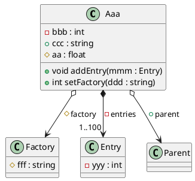

# PlantUML for GitHub

## Sequence Diagram

```plantuml
E(電力) ────────────────────────────────────────────────────────────────────────────┐
                                                                                    │
M(投稿データ) ───> [ 投稿データを ] ───> [ 入力形式を ] ──M(検証済データ)──┐         │
                    入力する             検証する                  │         │
                                                                   ▼         │
S(投稿要求)   ───> [ 不適切内容を ] <───────────────────────────────┘         │
                    除外する                                                 │
                        │                                                    │
                        ▼                                                    │
                   [ レイアウトを ]                                          │
                    配置する                                                 │
                        │                                                    │
                        ▼                                                    │
                   [ データを     ] ───M(保存データ)──┐                       │
                    記憶する                          │                       │
                                                      ▼                       ▼
S(表示要求)   ──────────────────────────────> [ 画面描画を ] ──> [ 表示画面を ] ──> M(表示画面)
                                               構成する           出力する
                                                                      │
                                                                      └─────────> S(完了通知)
```


## Class Diagram



