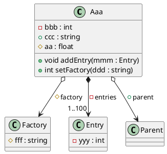

# PlantUML for GitHub

## Sequence Diagram

```plantuml
graph TD
    Root[デジタル寄せ書きシステム構築]

    %% 1. 要件・UI設計
    Root --> C1[1.0 要件・UI設計]
    C1 --> C11[1.1 システム要件定義・仕様書]
    C1 --> C12[1.2 UI/UXデザイン設計]
    C1 --> C13[1.3 実行委協議・申請]

    %% 2. システム開発
    Root --> C2[2.0 システム開発]
    C2 --> C21[2.1 フロントエンド開発]
    C2 --> C22[2.2 バックエンド・DB構築]
    C2 --> C23[2.3 モデレーション機能開発]
    C2 --> C24[2.4 フェイルセーフ機構開発]

    %% 3. モデレーション・テスト
    Root --> C3[3.0 モデレーション・テスト]
    C3 --> C31[3.1 モデレーション機能テスト]
    C3 --> C32[3.2 負荷・通信テスト]
    C3 --> C33[3.3 総合リハーサル]

    %% 4. 現地ネットワーク・スクリーン設営
    Root --> C4[4.0 現地ネットワーク・スクリーン設営]
    C4 --> C41[4.1 ネットワーク・回線確保]
    C4 --> C42[4.2 機材・スクリーン設営]
    C4 --> C43[4.3 案内POP・QRコード掲示]

    %% 5. 当日運用
    Root --> C5[5.0 当日運用]
    C5 --> C51[5.1 当日モニタリング・検閲]
    C5 --> C52[5.2 障害時対応・非常運用]
    C5 --> C53[5.3 アーカイブ・振り返り]
```


## Class Diagram



